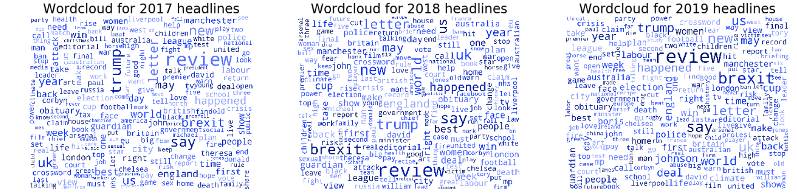
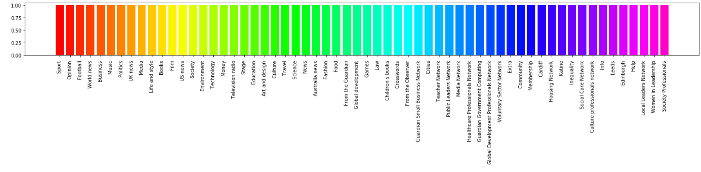
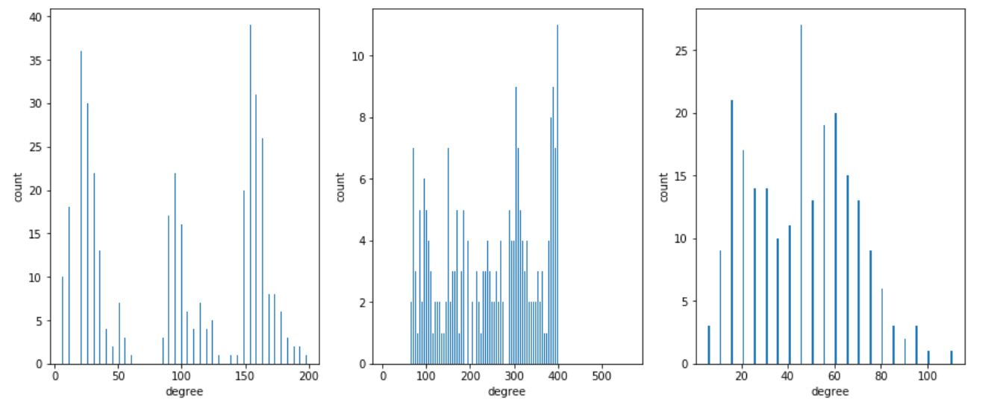

# What can we learn from 20 years of headlines?
=================================================================================================================================
At some point we stopped thinking about the way we consume media. The increase of journalistic sources, whether they are reliable or not, has only increased throughout the last two decades and the emergence of social media will only add data to the universe of information on the internet. 
Parting from this idea, we decided to work with 20 year of headlines extrated from the english newspaper **[The Guardian](https://www.theguardian.com/international)**. Fortunately for us, The Guardian is an open newspaper and has a respectable international edition. According to them, The Guardian is now the 3rd largest individual newspaper website in the world.

The downloaded data encompasses the period from the 7th of September of 2019 to the 11th of November of 2019 and approximately 77 MB of data. In the paper the news are classified in five categories: *News, Opinion, Sport, Culture and Lifestyle*. These categories are further subdivided in several other sub-categories. For more detailed information, please visit the [Explainer Notebook](https://nbviewer.jupyter.org/github/Miniphant/socialgraphs/blob/master/Final%20Project.ipynb).

## **How does it look?**
___

The number of headlines per year spans from 60000 thousand to 70000. A further subdivision by categories shows the amount of headlines per subcategory, and surprizingly for the whole period the largest sub-category was sports, followed by Opinion, football and world news.

________________________________________________________________

According to this, before aditional analysis one could expect a sports based entity of information, or just a lot of football. At this point one would start to wonder, is the sports section so big, because its an English paper? or having a sports section makes the newspaper profitable, and more in tune with its readers interests?
We thought it would have academic value to find the most impactful headlines and possibly dismiss our fears of being highly psycologically influenced by the football monopoly.

In this little universe of headlines, we had to start somewhere and after some impasses and tribulations, we decided to evaluate the by choosing a keyword, which would become the keyword of of a certain period and the following analysis would by centered on that big important event.

The results where somewhat unexpected for the selected periods for as you can see with some words with the highest rank in the table below:

| 2005-20010  | 2011-2015  | 2015-2019  |
|:-----------:|:----------:|:----------:|
|  newsbytes  |  rowson | greefell  |  
|  newsbucket |  boas | sportswatch  |  
| henley  |  bagshe |meetoo |    
| twitter  | walshe  | weatherwatch  | 
|  soundings | voucher  | wrack  |
|  garton | nsa  | slaven  |
| tims  | snowden  | thrasher  |   
| howlet  |  sudoku | valenti  |
|  tomasky | farage  | allardice  | 

Given the apparent randomness of the words, we chose the one person, phenomenon that we could effectively recognize as the representative of a five year period, in order the selected ocurrence are: **twitter, snowden and meetoo**. The frequency distribution of each ocurrence shows the number of headlines per period.

 

## The language
_______________

The language used in the headlines is concise and impersonal (except for the Opinion section), as opposed to other sources of text on the internet, namely social media. Consequently the corpus of the headlines, lacked distinctive slang, or culturally accepted expressions that could make the text analysis challenging. However there are is a considerable amount of acronyms or nouns that may be unrelated to the bigger picture.
As a first measure of analysis a wordcloud was biult based only on the frequency, and as it can be seen from the wordclouds below, the obvious words appear quite conspicuously: **Trump, brexit, jhonson, world, etc**. However, there are other less usual suspects in the mix: **say, year, word, happenes, review etc.,** wich are usual verbs or nouns that can be found in any form of written language.

So, what else can we do if we want to examine this corpus in a less obvious fashion? 

 To accomplish this purpose we used [term frequency–inverse document frequency](https://en.wikipedia.org/wiki/Tf%E2%80%93idf) (*TF-IDF*), which adds weight to the words that are important for the body of text.

### 2006-2010

The wordcloud selcted for this period is the one for the year 2009. Throughout this year, some of the the events with more relative importance: 
Obama was **inagurated** as president of the  US.  
The [count of tweets exploded](https://medium.com/dmrc-at-large/twitter-probably-isn-t-dying-but-is-it-becoming-less-sociable-d768a9968982) accoding to **twitter** usage statistics.   
[**Swine** flu outbreak](https://www.cdc.gov/flu/pandemic-resources/2009-h1n1-pandemic.html).   
The **bailout** of the too big too fail banks is still a thing.   

### 2011-2015
 
 
Some comments on this years wordcloud: 
**Snowden**'s whistleblowing was a big thing in 2013 and especially for **The guardian** due to the fact that the leaked information on the **NSA** (another big word), was leaked to the newspapers journalists.  
Cambridge **analytica** was founded.  
Active people in the international arena made their way into our wordcloud: Hassan **Rouhani**, Mohamed **Morsi**, **Tamerlan Tsarnaev**.  
And apparently a lot of people wrote to **[The Guardian Letters](https://www.theguardian.com/tone/letters)**. 

### 2015-2019
 
 
 And finally in 2018, some exciting ocurrences took place:
 The **[#metoo](https://twitter.com/hashtag/MeToo?src=hash&lang=/en)** movement reached its peak. 
 Jamal **Khashoggi** dissapeared in Turkey. 
 Sergei **Skripal**, a former Russian military officer was poisoned with **novichok**. 
 Judge Brett **Kavanaugh** was appointed to the supreme court. 
  In Britain, The Guardian revealed and published the **Windrush** scandal, a fire broke out in the **Grenfell**/ tower.

 
## The networks
________________

The network analysis includes three types of network centrality for each occurance: degree centrality, eigenvalue and betweeness.

An interesting and didacted tool was developed in order to understand the networks built on the basis of the news categories and subcategories, a simple colorscale.

### meetoo
The resulting network for each network, yielded 

The #MeToo phenomenon is associated mainly with the following categories: **society**, **US News** and **opinion**. This can be seen in the clusters created by the eigenvalue centrality measure.

### snowden

Snowdens appear this year is mainly grouped in the categories: **world news**, **media** and **society**.

### twitter

As for twitter, the categories that represent its advent in 2009 are: **technology** and **society**.

You are probably thinking that the networks are not saying much about what is relevant and what is not. So, we decided to graph some degree distributions and extract a little more information. The following graph shows the degree distribution for our three keywords: metoo, snowden and twitter.

The larger peaks in the distribution represent the biggest clusters per category, which relates to the information from the networks
nodes are more connected. The following step was to extract the most central nodes for each ocurrence and for each type of centrality measure.

## twitter

| Degree  |      Eigenvalue     | Betweeness  |
|----------|:-------------:|------:|
|  Twitter Facebook and Google turn red for World Aids Day |  Twitter Facebook and Google turn red for World Aids Day | Twitter crowd goes bananas at SXSW |
| Traffic to Twitter and Facebook fell in February in US says Compete  |  Twitter Facebook Google and LiveJournal under attack  |    Do you use Twitter for reporting  |
| Twitter Facebook Google and LiveJournal under attack   | A good day for phishing on Facebook and Twitter |  Forecast for 2011 Mark Rock on Twitter s IPO and Arrington leaving TechCrunch |

## snowden

| Degree  |      Eigenvalue     | Betweeness  |
|----------|:-------------:|------:|
|    Hillary Clinton NSA whistleblower Edward Snowden has right to legal defence in US video interview  |   Hillary Clinton NSA whistleblower Edward Snowden has right to legal defence in US video interview  | Autre Ne Veut creating protest songs for the Snowden generation  |
| Edward Snowden s explosive NSA leaks have US in damage control mode  |   Edward Snowden s explosive NSA leaks have US in damage control mode    |    Laura Snowden review a young guitarist of poise and intensity   |
| US may never know extent of Edward Snowden NSA leaks report   | NSA director Edward Snowden has caused irreversible damage to US  |  How would Snowden vote Republican debate shows limited options  |

## metoo

| Degree  |      Eigenvalue     | Betweeness  |
|----------|:-------------:|------:|
|   The MeToo movement gave a voice to silenced women so why are films about it all made by men  |  The MeToo movement gave a voice to silenced women so why are films about it all made by men  | Judy Punch review brutal and brilliantly bizarre MeToo fairytale  |
| So men are afraid after MeToo Think about what it s like for women Jessica Valenti  | So men are afraid after MeToo Think about what it s like for women Jessica Valenti   |    Women with a MeToo complaint are being silenced for the sake of politics Gaby Hinsliff   |
|  How should young women react as MeToo moves into dating Female writers discuss Anne Perkins Iman Amrani Marie Le Conte Rachel Shabi and Ash Sarkar  |  Young women are smashing it at Edinburgh as the MeToo legacy kicks in Rhiannon Lucy Cosslett  |   Metoo trend highlights sexual harassment in wake of Weinstein claims  |

## Sentiment of the headlines
_____________________________

