## What can we learn from 20 years of headlines?

At some point we stopped thinking about the way we consume media. The increase of journalistic sources, whether they are reliable or not, has only increased throughout the last two decades and the emergence of social media will only add data to the universe of information on the internet. 
Parting from this idea, we decided to work with 20 year of headlines extrated from the english newspaper *[Theguardian](https://www.theguardian.com/international)*. Fortunately for us, **The Guardian** is an open newspaper and has a respectable international edition. According to them, The Guardian is now the 3rd largest individual newspaper website in the world.

The downloaded data encompasses the period from the 7th of September of 2019 to the 11th of November of 2019 and approximately 77 MB of data. In the paper the news are classified in five categories: *News, Opinion, Sport, Culture and Lifestyle*. These categories are further subdivided in several other sub-categories.

### How does it look?
_____________________

The number of headlines per year spans from 60000 thousand to 70000. A further subdivision by categories shows the amount of headlines per subcategory, and surprizingly for the whole period the largest sub-category was sports, followed by Opinion, football and world news.

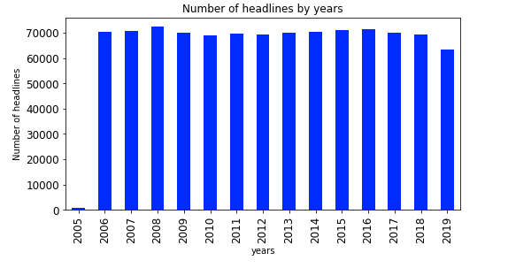 
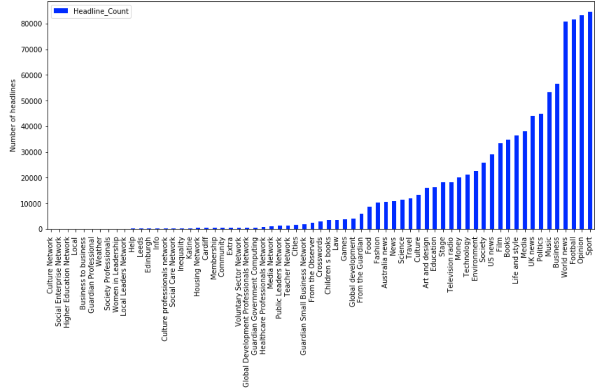

According to this, before aditional analysis one could expect a sports based entity of information, or just a lot of football. At this point one would start to wonder, is the sports section so big, because its an English paper? or having a sports section makes the newspaper profitable, and more in tune with its readers interests?
We thought it would have academic value to find the most impactful headlines and possibly dismiss our fears of being highly psycologically influenced by the football monopoly.

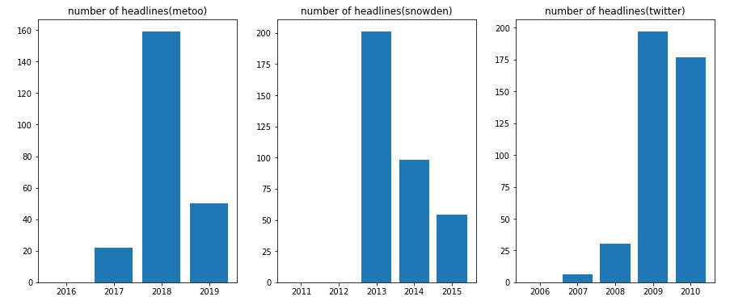

### The networks
________________

The first part of the headline analysis includes a network analysis.

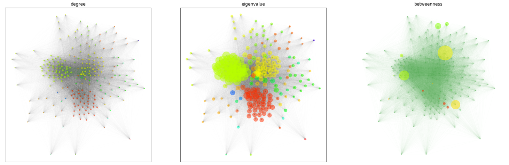

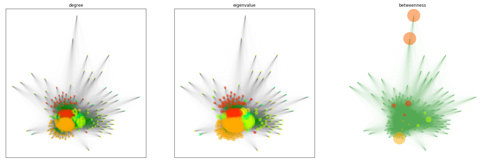

## The language
_______________

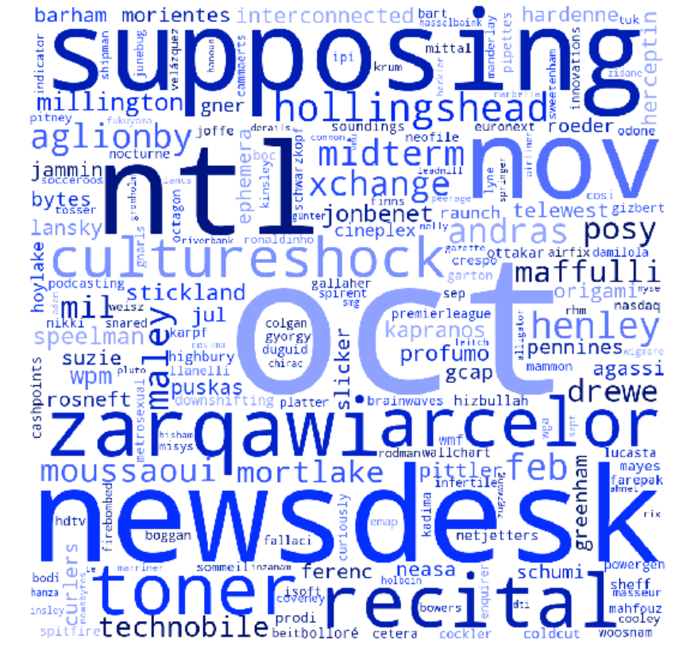 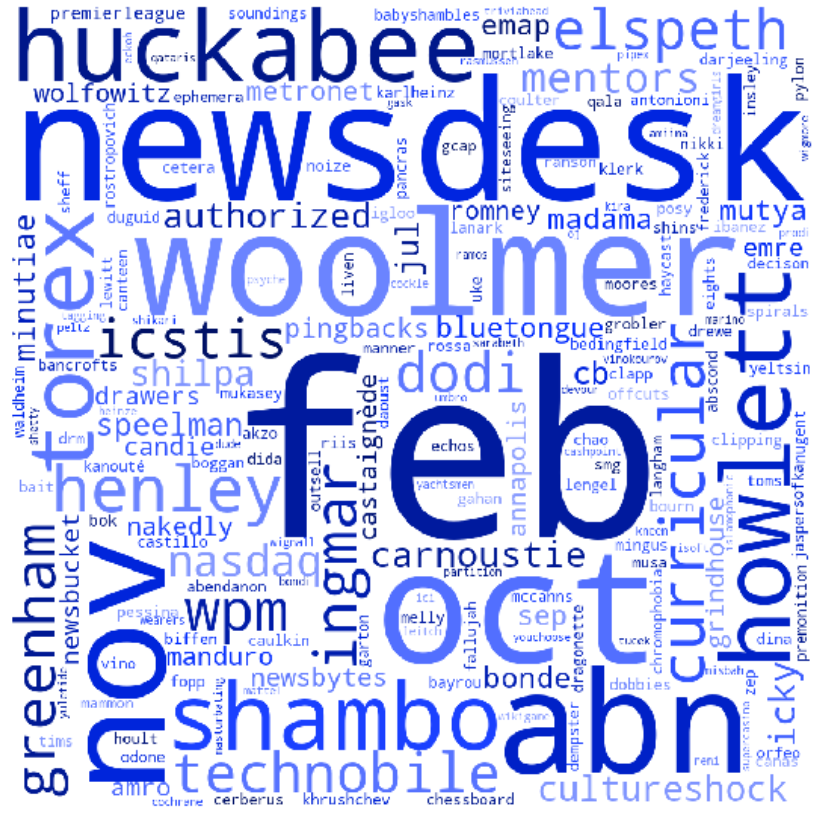 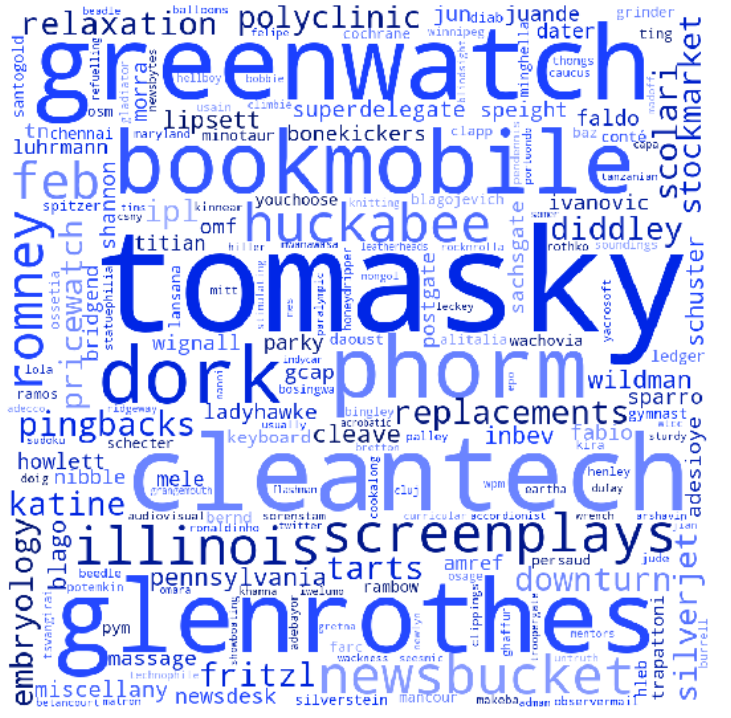 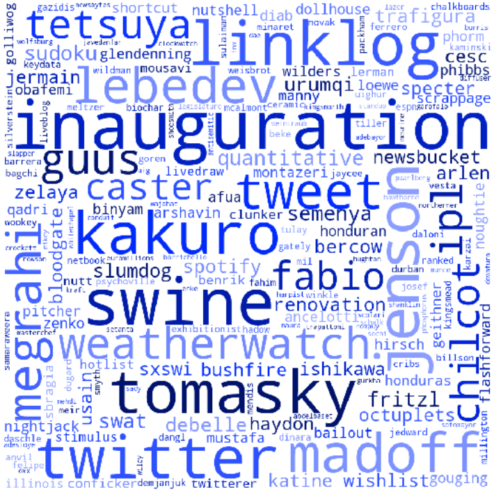 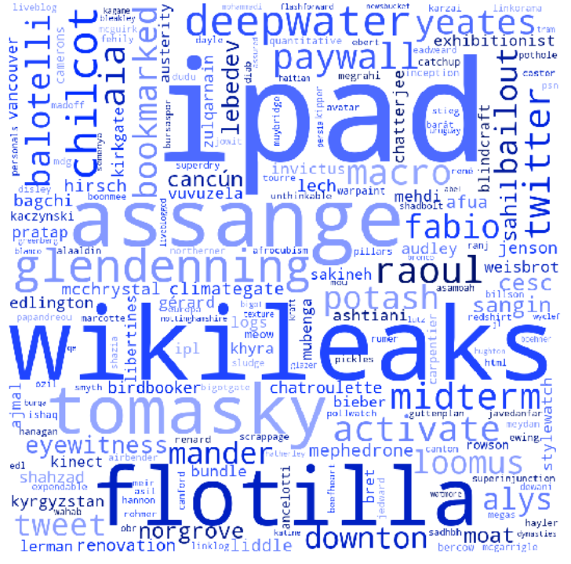 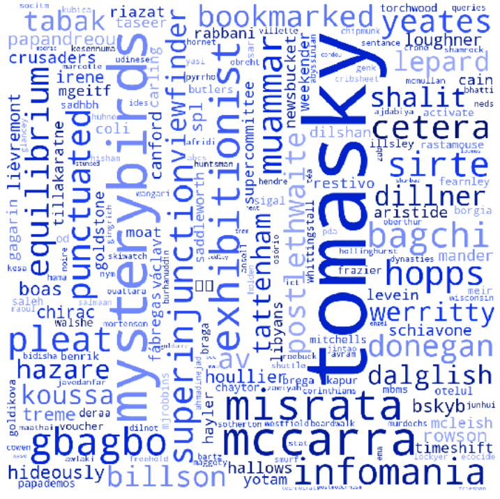 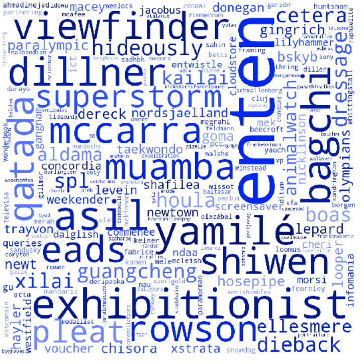 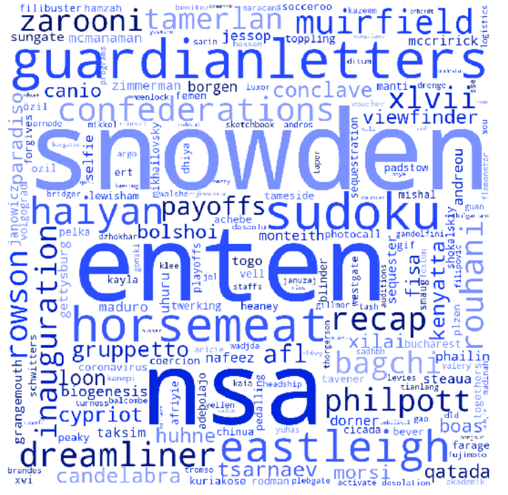 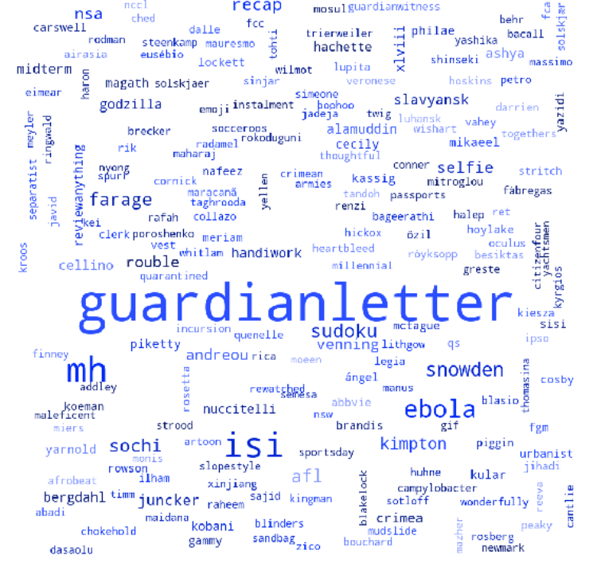 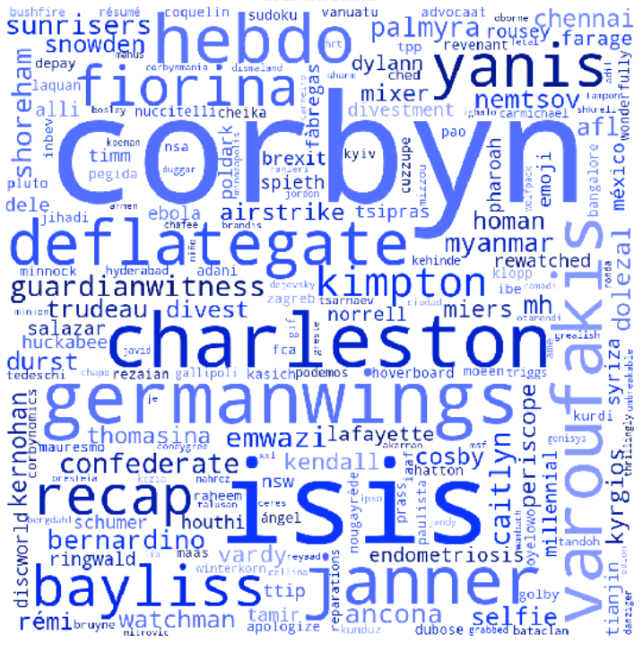 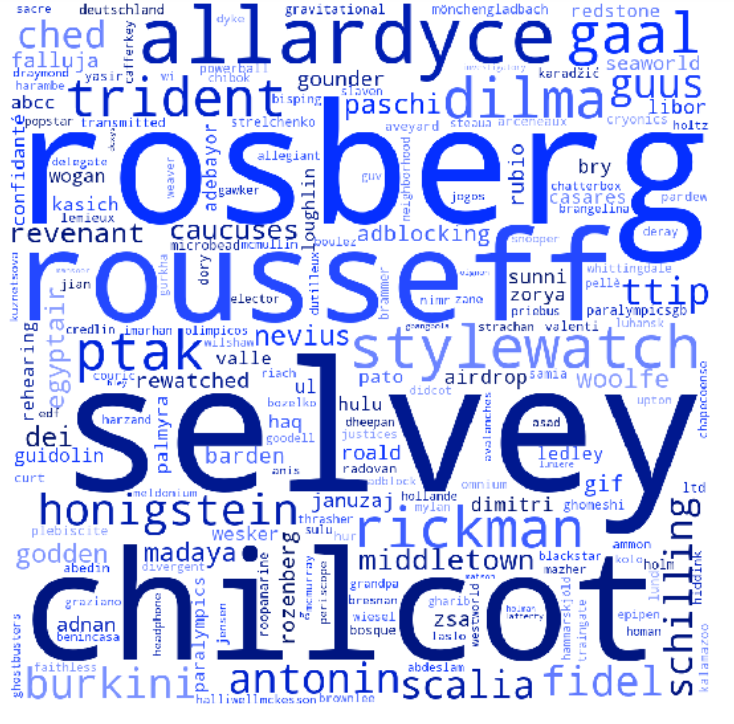 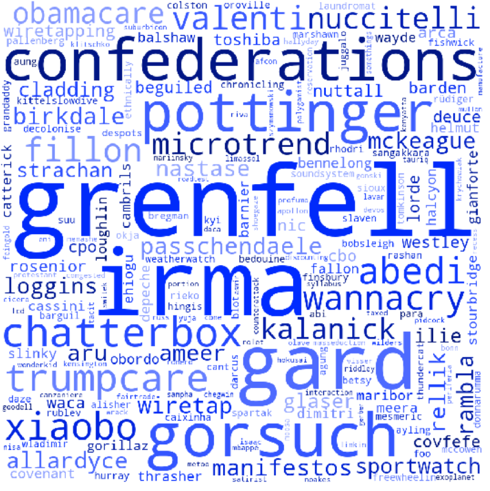 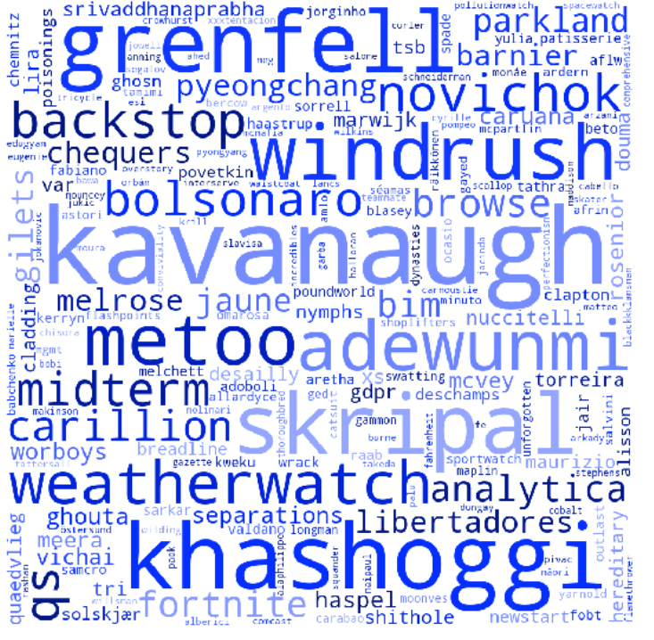 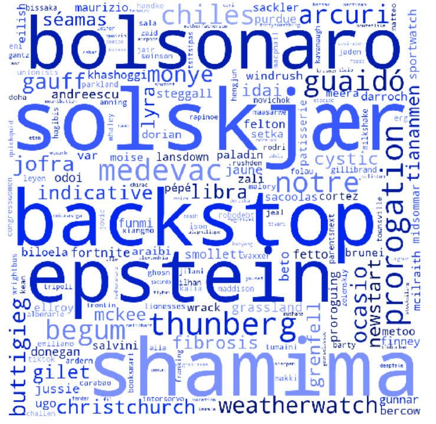

## Sentiment of the headlines{: style="color: red; opacity: 0.80;" }
_____________________________

