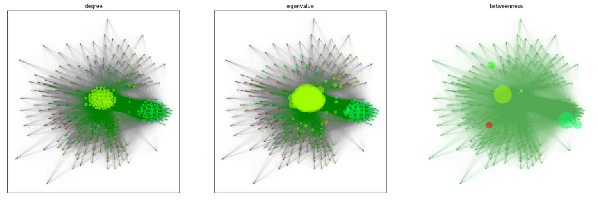

# What can we learn from 20 years of headlines?

At some point we stopped thinking about the way we consume media. The increase of journalistic sources, whether they are reliable or not, has only increased throughout the last two decades and the emergence of social media will only add data to the universe of information on the internet. 
Parting from this idea, we decided to work with 20 year of headlines extrated from the english newspaper *[The Guardian](https://www.theguardian.com/international)*. Fortunately for us, **The Guardian** is an open newspaper and has a respectable international edition. According to them, The Guardian is now the 3rd largest individual newspaper website in the world.

The downloaded data encompasses the period from the 7th of September of 2019 to the 11th of November of 2019 and approximately 77 MB of data. In the paper the news are classified in five categories: *News, Opinion, Sport, Culture and Lifestyle*. These categories are further subdivided in several other sub-categories.

## How does it look?
_____________________

The number of headlines per year spans from 60000 thousand to 70000. A further subdivision by categories shows the amount of headlines per subcategory, and surprizingly for the whole period the largest sub-category was sports, followed by Opinion, football and world news.

                                                                             _____

According to this, before aditional analysis one could expect a sports based entity of information, or just a lot of football. At this point one would start to wonder, is the sports section so big, because its an English paper? or having a sports section makes the newspaper profitable, and more in tune with its readers interests?
We thought it would have academic value to find the most impactful headlines and possibly dismiss our fears of being highly psycologically influenced by the football monopoly.

In this little universe of headlines, we had to start somewhere and after some impasses and tribulations, we decided to evaluate the by choosing a keyword, which would become the keyword of of a certain period and the following analysis would by centered on that big important event.

The results where somewhat unexpected for the selected periods for as you can see with some words with the highest rank in the table below:

| 2005-20010  | 2011-2015  | 2015-2019  |
|:-----------:|:----------:|:----------:|
|  newsbytes  |  rowson | greefell  |  
|  newsbucket |  boas | sportswatch  |  
| henley  |  bagshe |meetoo |    
| twitter  | walshe  | weatherwatch  | 
|  soundings | voucher  | wrack  |
|  garton | nsa  | slaven  |
| tims  | snowden  | thrasher  |   
| howlet  |  sudoku | valenti  |
|  tomasky | farage  | allardice  | 

Given the apparent randomness of the words, we chose the one person, phenomenon that we could effectively recognize as the representative of a five year period, in order the selected ocurrence are: **twitter, snowden and meetoo**. The frequency distribution of each ocurrence shows the number of headlines per period.

## The network
________________

The network analysis includes three types of network calculation for each ocurrence.

### twitter

### snowden

### meetoo

## The language
_______________

The language used in the headlines is concise and impersonal (except for the Opinion section), as opposed to other sources of text on the internet, namely social media. Consequently the corpus of the headlines, lacked distinctive slang, or culturally accepted expressions that could make the text analysis challenging. However there are is a considerable amount of acronyms or nouns that may be unrelated to the bigger picture.
As a first measure of analysis a wordcloud was biult based only on the frequency, and as it can be seen from the wordclouds below, the obvious words appear quite conspicuously: **Trump, brexit, jhonson, world, etc**. However, there are other less usual suspects in the mix: **say, year, word, etc.**

with tf idf
 
 
 
 
 

## Sentiment of the headlines
_____________________________

